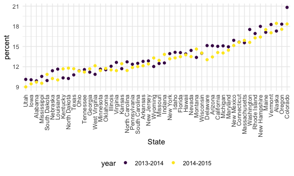

Strings and Factors
================

## String vectors

``` r
string_vec = c("my", "name", "is", "jeff")

str_detect(string_vec, "Jeff") # case-sensitive
```

    ## [1] FALSE FALSE FALSE FALSE

``` r
str_detect(string_vec, "a")
```

    ## [1] FALSE  TRUE FALSE FALSE

``` r
str_replace(string_vec, "jeff", "Jeff")
```

    ## [1] "my"   "name" "is"   "Jeff"

``` r
str_replace(string_vec, "m", "M")
```

    ## [1] "My"   "naMe" "is"   "jeff"

When you need to deal with some **regular expressions** …

``` r
string_vec = c(
  "i think we all rule for participating",
  "i think i have been caught",
  "i think this will be quite fun actually",
  "it will be fun, i think"
  )

str_detect(string_vec, "^i think") # ^: begin with the regular expression
```

    ## [1]  TRUE  TRUE  TRUE FALSE

``` r
str_detect(string_vec, "i think$") # $: end with the regular expression
```

    ## [1] FALSE FALSE FALSE  TRUE

``` r
string_vec = c(
  "Y'all remember Pres. HW Bush?",
  "I saw a green bush",
  "BBQ and Bushwalking at Molonglo Gorge",
  "BUSH -- LIVE IN CONCERT!!"
  )

str_detect(string_vec, "Bush")
```

    ## [1]  TRUE FALSE  TRUE FALSE

``` r
str_detect(string_vec, "[Bb]ush") # upper case or lower case b
```

    ## [1]  TRUE  TRUE  TRUE FALSE

``` r
str_detect(string_vec, "[Bb][Uu][Ss][Hh]")
```

    ## [1] TRUE TRUE TRUE TRUE

A number followed by letter(s)

``` r
string_vec = c(
  '7th inning stretch',
  '1st half soon to begin. Texas won the toss.',
  'she is 5 feet 4 inches tall', # number followed by space
  '3AM - cant sleep :('
  )

str_detect(string_vec, "[0-9][a-zA-Z]")
```

    ## [1]  TRUE  TRUE FALSE  TRUE

``` r
string_vec = c(
  'Its 7:11 in the evening',
  'want to go to 7-11?',
  'my flight is AA711',
  'NetBios: scanning ip 203.167.114.66'
  )

str_detect(string_vec, "7.11") # "." indicates anything except for nothing
```

    ## [1]  TRUE  TRUE FALSE  TRUE

To find a real bracket ..?

``` r
string_vec = c(
  'The CI is [2, 5]',
  ':-]',
  ':-[',
  'I found the answer on pages [6-7]'
  )

str_detect(string_vec, "\\[")
```

    ## [1]  TRUE FALSE  TRUE  TRUE

``` r
str_detect(string_vec, "\\[[0-9]")
```

    ## [1]  TRUE FALSE FALSE  TRUE

## Why factors are weird

``` r
factor_vec = factor(c("male", "male", "female", "female"))

as.numeric(factor_vec) # convert into numeric
```

    ## [1] 2 2 1 1

``` r
factor_vec = fct_relevel(factor_vec, "male")

as.numeric(factor_vec)
```

    ## [1] 1 1 2 2

## NSDUH

``` r
nsduh_url = "http://samhda.s3-us-gov-west-1.amazonaws.com/s3fs-public/field-uploads/2k15StateFiles/NSDUHsaeShortTermCHG2015.htm"

table_marj = 
  read_html(nsduh_url) %>% 
  html_table() %>% 
  first() %>% 
  slice(-1)
```

tidy up the NSDUH data …

``` r
marj_df = 
  table_marj %>% 
  select(-contains("P value")) %>% 
  pivot_longer(
    -State,
    names_to = "age_year",
    values_to = "percent"
  ) %>% 
  mutate(
    percent = str_replace(percent, "[a-b]$", ""),
    percent = as.numeric(percent)
  ) %>% 
  separate(age_year, into = c("age", "year"), sep = "\\(") %>% 
  mutate(
    year = str_replace(year, "\\)", "")
  ) %>% 
  filter(
    !(State %in% c("Total U.S.", "Northeast", "Midwest", "South", "West", "District of Columbia"))
  )
```

``` r
marj_df %>% 
  filter(age == "12-17") %>% 
  mutate(State = fct_reorder(State, percent)) %>% 
  ggplot(aes(x = State, y = percent, color = year)) +
  geom_point() +
  theme(axis.text.x = element_text(angle = 90, vjust = 0.5, hjust = 1))
```


